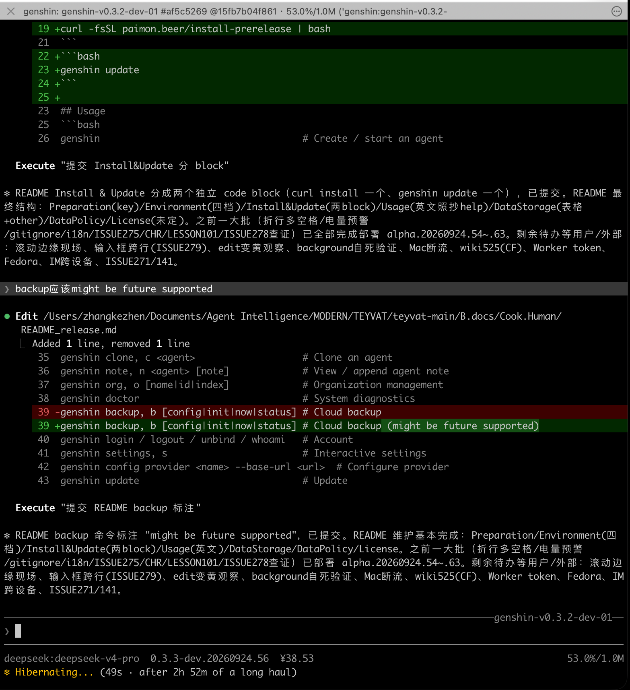

# Teyvat



Person-based AI agent framework. Each agent has persistent memory, identity, and biological metaphor architecture running on [pi](https://pi.dev).

## Preparation

- DeepSeek API key, or any compatible API key

## Environment

- Full support: macOS / Linux
- As much support: WSL
- Limited support: Windows & Android
- Future support: Web Sandbox

## Install & Update

```bash
curl -fsSL paimon.beer/install-prerelease | bash
```

```bash
genshin update
```

## Usage

```bash
genshin                                    # Create / start an agent
genshin kill, k <agent>                    # Kill a running agent
genshin archive, a <agent>                 # Archive an agent
genshin unarchive, ua <agent>              # Restore an archived agent
genshin archived, A                        # List archived agents
genshin rename <old> <new>                 # Rename an agent
genshin clone, c <agent>                   # Clone an agent
genshin note, n <agent> [note]             # View / append agent note
genshin org, o [name|id|index]             # Organization management
genshin doctor                             # System diagnostics
genshin backup, b [config|init|now|status] # Cloud backup (might be future supported)
genshin login / logout / unbind / whoami   # Account
genshin settings, s                        # Interactive settings
genshin config provider <name> --base-url <url>  # Configure provider
genshin update                             # Update
```

See `genshin help` for more commands.

## Data Storage

All agent data lives in `~/.teyvat/`:

| Directory | Content |
|-----------|---------|
| `MemoryData/<id>/` | Agent memory (context) |
| `SessionData/<id>/` | Conversation session logs |
| `config/` | Settings and credentials |
| other | Everything else |

## Data Policy

- All agent data stays local in `~/.teyvat/` by default.
- Cloud backup (`genshin backup`) is optional and opt-in.

## License

License not decided.
